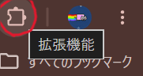
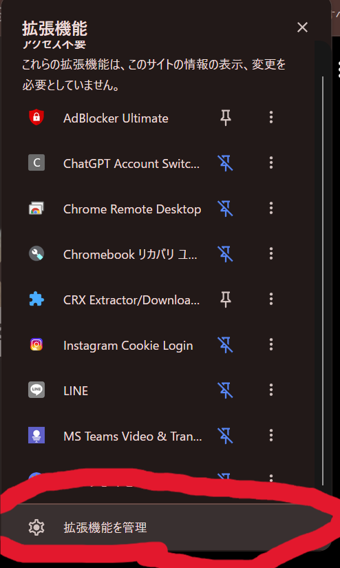
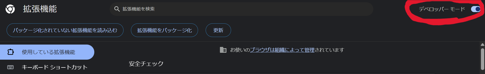
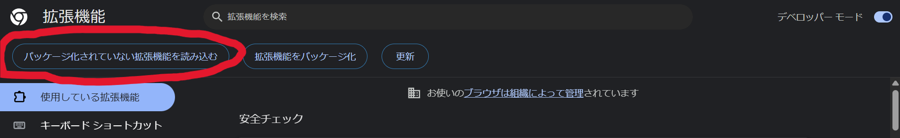
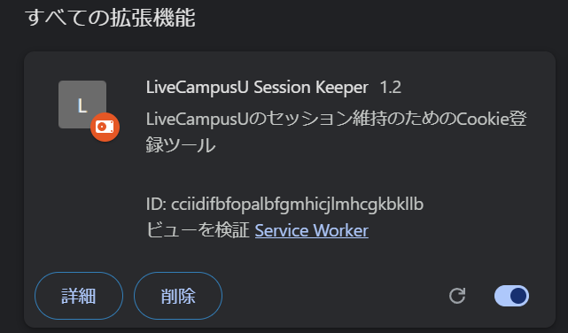

# LiveCampusU Session Keeper

Developed by [psannetwork](https://github.com/psannetwork)

LiveCampusUのセッション維持を目的としたChrome拡張機能です。

---

## セットアップ方法

以下の手順でインストールしてください（ChromeおよびMicrosoft Edgeに対応しています）。

### 0. 拡張機能のダウンロード
まず、[GitHubのReleasesページ](https://github.com/psannetwork/LiveCampusU-AntiLogout-Ex/releases)から最新の `LiveCampusU-AntiLogout-Ex.zip` をダウンロードし、ファイルを解凍してください。

### 1. 拡張機能管理ページを開く
Chromeのアドレスバーに `chrome://extensions` と入力してエンターキーを押し、拡張機能管理ページを開きます。

または、ブラウザ右上のメニューから開くことも可能です。

| 1. 拡張機能アイコン | 2. 拡張機能一覧から選択 |
| :--- | :--- |
|  |  |

その後、画面右上の**「デベロッパーモード」**をONにしてください。

### 2. 拡張機能を読み込む
「パッケージ化されていない拡張機能を読み込む」ボタンをクリックし、ダウンロード・解凍したフォルダを選択してください。

### 3. インストール確認
成功すると、以下のように拡張機能が一覧に表示されます。

---

## 注意事項

本拡張機能は対象サイト（LiveCampusU）の仕様に基づいて動作します。そのため、**サイト側の仕様や構造が変更された場合、本拡張機能が正常に動作しなくなる可能性がある**ことをあらかじめご了承ください。